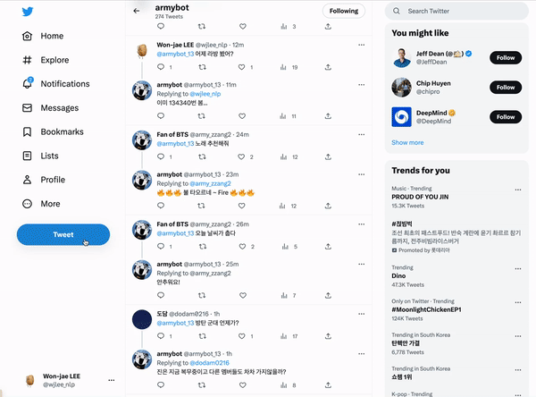

<p align="center"></p>

<br/>

## 1️⃣ Introduction
같이 덕질하자! **ArmyBot**은 흔한 아미 트친(BTS을 응원하는 트위터 친구)처럼 이런 저런 이야기를 나눌 수 있는 챗봇 서비스입니다.<br/>
**BTS 관련 덕심 가득한 질문부터 일상 대화**까지 [@armybot_13](https://twitter.com/armybot_13)으로 트윗만 보내면 ArmyBot이 답장을 합니다.

<br/>

## 2️⃣ 팀원 소개

김별희|이원재|이정아|임성근|정준녕|
:-:|:-:|:-:|:-:|:-:
</img>|</img>|</img>|</img>|</img>
[Github](https://github.com/kimbyeolhee)|[Github](https://github.com/wjlee-ling)|[Github](https://github.com/jjeongah)|[Github](https://github.com/lim4349)|[Github](https://github.com/ezez-refer)


### Contribution

- `김별희` 트위터 데이터 수집 및 전처리 파이프라인 구축, answer retriever 구축
- `이원재` 서비스 기획 및 PM, 사전학습용 데이터 수집 및 전처리, 답변 관련 처리
- `이정아` 스팸 필터링 데이터 수집 및 모델 구축, 트위터 연결 및 서비스, 생성 모델 파이프라인 구축, 키워드 시각화
- `임성근` 더쿠 데이터 수집 및 전처리 파이프라인 구축, 정보성 데이터 수집
- `정준녕` 생성 모델 파이프라인 구축, 생성 모델 프로토타입 및 시연용 데모 페이지 구현, 챗봇 서비스용 데이터 구축

<br/>

## 3️⃣ Demo Video



<br/>

## 4️⃣ Service Architecture

<p align="center"></p>

1. 사용자가 봇계정을 태그하고 트윗 작성
2. 악성 트윗 필터링
    1. 악성 트윗 판단 시 고정된 답변 반환
3. 인텐트 키워드 매칭 및 BM25기반 Elastic Search
    1. Retrieve된 reply의 BM25 점수가 기준점을 넘으면서 인텐트 키워드 매칭도 일치하는 경우
    해당 reply를 후처리하여 사용자에게 반환
    2. 위 두 조건을 만족시키지 못하는경우 Generation 모델에 입력 후 결과를 혐오 표현 필터링을 거친 뒤 사용자에게 반환
4. 입출력 분석을 위해 input/output 및 기타 정보를 mongoDB에 저장

<br/>

<details>
    <summary><b><font size="10">Project Tree</font></b></summary>
<div markdown="1">

```
.
|-- agent.py # 트위터 챗봇 서비스 최종 코드
|-- chatbot # 챗봇 generator, retriever 모델 모듈
|   |-- generator
|   |-- pipeline
|   |-- readme.md
|   `-- retriever
|-- corpus # 코퍼스 구축 모듈
|   |-- README.md
|   |-- build_corpus.py
|   |-- crawlers
|   `-- twitter_classification
|-- database
|   `-- mongodb.py
|-- install_requirements.sh
|-- notebook
|   |-- AIhub_data_to_csv.ipynb # 데이터를 csv로 변환
|   |-- spell_compare.ipynb # 맞춤법 교정 라이브러리 성능 비교
|   `-- upload_dataset_to_huggingface.ipynb # 데이터셋을 HF에 ㅇ
|-- poetry.lock
|-- prototype # 프로토타입 app 모듈
|   |-- Makefile
|   |-- app
|   |-- config
|   |-- poetry.lock
|   |-- pyproject.toml
|   |-- readme.md
|   `-- requirements.txt
|-- pyproject.toml
|-- readme.md
|-- requirements.txt
|-- spam_filter # 스팸 필터 모듈
|   |-- config
|   |-- data_loader
|   |-- readme.md
|   |-- spam_filter.py
|   |-- spam_inference.py
|   `-- spam_train.py
|-- twitter # 트위터 연결 모듈
|   |-- automatic_reply.py
|   |-- config
|   |-- data_pipeline.py
|   |-- last_seen_id.txt
|   |-- main.py
|   |-- readme.md
|   |-- tweet_pipeline.py
|   `-- utils
`-- utils
    |-- EDA.py # kiwi로 단어 빈도수 확인
    |-- base_config.yaml
    |-- classes.py # dataclass 모듈별 입출력 포맷
    |-- push_model_to_hub.py # huggingface에 모델 업로드
    `-- wordcloud.py # 워드클라우드로 단어 시각화
```
    
</div>
</details>

<br/>

## 5️⃣ DataSets
<p align="center"></p>

- [AI Hub 연예뉴스](https://aihub.or.kr/aihubdata/data/view.do?currMenu=115&topMenu=100&aihubDataSe=realm&dataSetSn=625) : 3,144개 10.67MB
- 네이버 뉴스 BTS 관련 기사 : 1,337개 4.85MB
- [일상 대화 및 위로 문답 챗봇 데이터](https://github.com/songys/Chatbot_data) : 962,681개 108.43MB
- BTS 관련 네이버 지식인 : 7,785개 8.70MB
- 더쿠 BTS 카테고리 글/댓글 : 13,709개 3.53MB
- 트위터 BTS 팬 트윗/답글 : 8,106개 1.45MB
- [Korean-hate-speech](https://github.com/kocohub/korean-hate-speech) : 7,896개
- [KOLD](https://github.com/boychaboy/KOLD) : 40,429개
- [Korean_unsmile_data](https://github.com/smilegate-ai/korean_unsmile_dataset) : 7,896개
- [Curse-detection-data](https://github.com/2runo/Curse-detection-data) : 6,154개

## 6️⃣ Modeling
- Generation model
    - paust/pko-t5-base 기반 pretrainig + finetuning
        - [nlpotato/pko-t5-base_ver1.1](https://huggingface.co/nlpotato/pko-t5-base_ver1.1)
    - BTS 관련 토큰 추가
        - Vocab size : 50383
        - "BTS", "bts", "RM", "rm", "진", "김석진", "석진", "김남준", "남준", "슈가", "민윤기", "윤기", "제이홉", "정호석", "지민", "박지민", "뷔", "김태형", "태형", "V", "정국", "전정국", "아미", "빅히트", "하이브", "아미", "보라해"
    - Finetuning

        1. 일상 대화 및 위로 문답 챗봇 데이터
        2. BTS 관련 네이버 지식인 데이터
        3. 더쿠 BTS 카테고리 글/댓글 + 트위터 BTS 팬 트윗/답글 데이터
    - Model size : 1.1GB
    - Number of trainable parameters : 275,617,536
- Retreiver model
    - Elastic Search with BM25
- Spam filtering model
    - bert-base

<br/>

## 7️⃣ How to Run
### Clone Repo & Install dependency

```python
$ git clone https://github.com/boostcampaitech4lv23nlp2/final-project-level3-nlp-13.git
$ cd final-project-level3-nlp-13
$ poetry install

```

### Set up Elastic Search

```python
$ bash install_elastic_search.sh
```

### Run

```python
$ python agent.py
```

<br/>

## 8️⃣  Future Works
- 2023년 2월 9일부터 트위터 무료 API 서비스 중단 대비
- 키워드 매칭 기반 **intent classification & entity recognition 개선**
    - FastText 임베딩 도입
    - 머신러닝 기반 intent classifier & entity detector로 전환
- 생성 모델 개선
    - 학습 데이터 및 전처리 추가, 추가 실험 및 최적화
- 서비스 품질 개선
    - DB에 **intent와 답변 템플릿 추가**
- 악성 트윗 필터링 개선
    - **비꼬는 문장**들 위주로 학습 데이터 추가
- **Salient Span Masking**을 도입한 사전학습
    - BTS 관련 주요 키워드 위주로 마스킹을 적용하는 사전학습
- 답장 외 챗봇의 글 생성 기능 및 **이벤트** 기능 추가
- 싱글턴 → **멀티턴 방식**의 챗봇으로 **대화 문맥을 고려**하여 답변하도록 개선

<br/>

## 9️⃣ Development Environment

- 협업툴 : Notion, Slack, Huggingface, Wandb
- 개발 환경
    - GPU: V100
    - 언어: Python==3.8.5
    - dependency: PyTorch == 1.13.1
